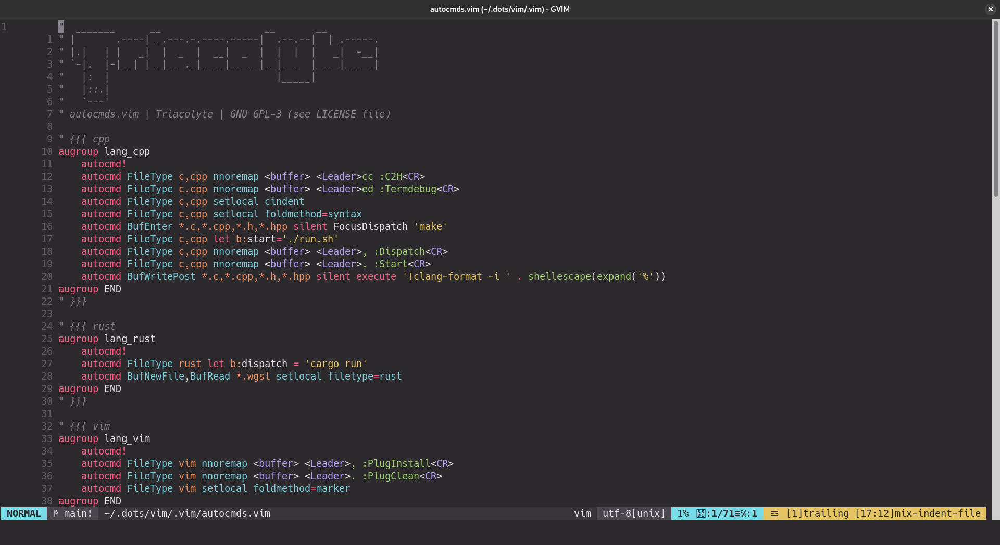

# Dotfiles
My personal dotfiles for Linux installations.

## Installation

### Downloading

```
git clone https://github.com/triacolyte/dotfiles ~/.dots
```

### Install dotfiles

Once downloaded, use GNU `stow` to install dotfiles to your system selectively.

It will symlink everything in the directory you choose to your home folder.

For example, here's how you enable vim dotfiles:
```
cd ~/.dots
stow vim
```

Now, `vim/.vim` has been symlinked to `~/.vim`!

### Uninstall dotfiles 

To uninstall dotfiles, use `stow` with the `-D` flag:
```
stow -D vim
```

Now, `~/.vim` no longer exists.

## Showcase

### Vim

```
stow vim
```



#### Plugins
- [tpope/vim-surround](https://github.com/tpope/vim-surround)
- [tpope/vim-commentary](https://github.com/tpope/vim-commentary)
- [mattn/emmet-vim](https://github.com/mattn/emmet-vim)
- [jiangmiao/auto-pairs](https://github.com/jiangmiao/auto-pairs)
- [kien/ctrlp.vim](https://github.com/kien/ctrlp.vim)
- [tpope/vim-vinegar](https://github.com/tpope/vim-vinegar)
- [luochen1990/rainbow](https://github.com/luochen1990/rainbow)
- [tomasiser/vim-code-dark](https://github.com/tomasiser/vim-code-dark)
- [vim-airline/vim-airline](https://github.com/vim-airline/vim-airline)
- [tpope/vim-fugitive](https://github.com/tpope/vim-fugitive)
- [tpope/vim-rhubarb](https://github.com/tpope/vim-rhubarb)
- [szw/vim-maximizer](https://github.com/szw/vim-maximizer)
- [sheerun/vim-polyglot](https://github.com/sheerun/vim-polyglot)
- [rust-lang/rust.vim](https://github.com/rust-lang/rust.vim)
- [ziglang/zig.vim](https://github.com/ziglang/zig.vim)
- [neoclide/jsonc.vim](https://github.com/neoclide/jsonc.vim)
- [leafgarland/typescript-vim](https://github.com/leafgarland/typescript-vim)
- [thetek42/vim-blueprint-syntax](https://github.com/thetek42/vim-blueprint-syntax)
- [jpalardy/vim-slime](https://github.com/jpalardy/vim-slime)
- [tpope/vim-dispatch](https://github.com/tpope/vim-dispatch)
- [puremourning/vimspector](https://github.com/puremourning/vimspector)
- [epheien/termdbg](https://github.com/epheien/termdbg)
- [ycm-core/YouCompleteMe](https://github.com/ycm-core/YouCompleteMe)
- [linluk/vim-c2h](https://github.com/linluk/vim-c2h)
- [iamcco/markdown-preview.nvim](https://github.com/iamcco/markdown-preview.nvim)
